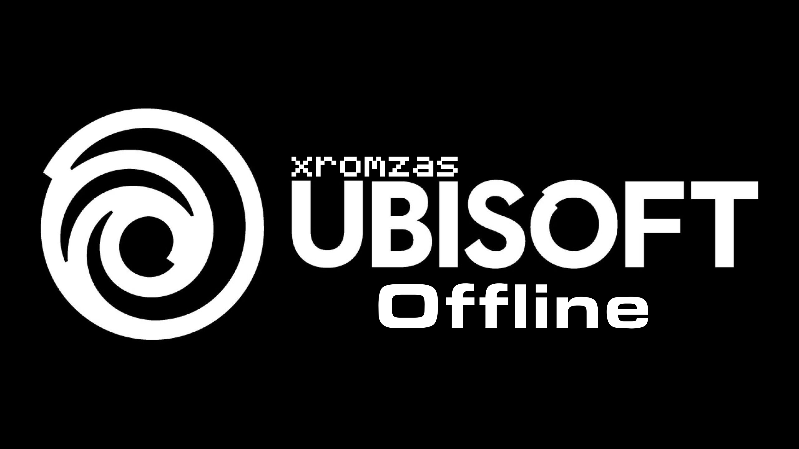

# Переключатель автономного режима Ubisoft Launcher

## Описание
Этот пакетный скрипт позволяет переключать автономный режим в Ubisoft launcher.

## Использование
1. Откройте файл UbisoftOffline.bat.
2. Выберите один из двух вариантов
3. Готово!

## Пример

## Лицензия
Этот скрипт выпущен под лицензией Apache 2.0.
